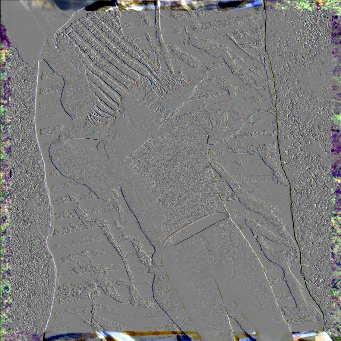
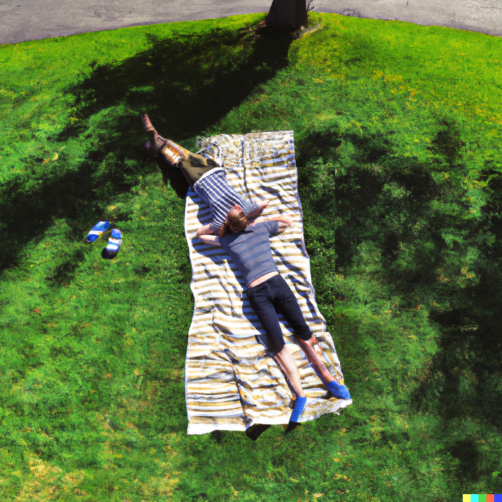

# InfinityZoom
<!-- TODO: This was the first name that came to my mind. Maybe  -->

Designed for [DALL·E 2](https://openai.com/dall-e-2/), this program facilitates the creation of mesmerizing “infinite” zooms.


## Installation
<!-- TODO: Provide a PyPI package -->
```bash
pip install -r requirements.txt
```
⚠️ TODO: Manim does not handle transparencies the way we need it to – yet.
I somewhat fixed this, but it has not landed upstream yet.
See [this PR](https://github.com/ManimCommunity/manim/pull/2923).

## Usage
1. Create a base image by giving DALL·E 2 a prompt of your choice ([link](https://labs.openai.com/)) and dump it into the [`images`](images/) folder.
2. Feed the base image into [`main.py`](main.py) to create an outcropped version (named `….zoomed.png`)
   ```bash
   python main.py
   ```
3. Upload the outcropped image back to the DALL·E 2 website.
   - Hint: Look for *“Or, upload an image to edit”*
4. Repeat steps **2.** and **3.** as often as you like.
5. Run [`generate_video_manim.py`](generate_video_manim.py) to create the zoom animation:
   ```bash
   manim generate_video_manim.py
   ```
   - Look for *“File ready at”* in the console output for the video's location.
   - See [`manim.cfg`](manim.cfg) for configuration options like fps, resolution, etc.
   - You can override the configuration options by passing them as arguments. For example, for a low-quality preview:
      ```bash
      manim -r 512,512 --fps 10 generate_video_manim.py
      ```

## Examples
> 🛈 These were not actually generated with this program, but are representative of its output.
- [Inside Her Head - DALLE-2 Uncrop Animation](https://www.youtube.com/watch?v=ICQNsyXNEa4)
- *Feel free to add yours by submitting a pull request!*


## Theory
### Rate function
In each time interval, we want to zoom out by a factor of 3.
That is, what filled the (quadratic) screen before, now occupies a ninth of the screen.
This leads to an **exponential function**:

> scale = BASE_SIZE / (3^t) = BASE_SIZE * (3^-t)


### Cropping/Padding
When inpainting, DALL·E 2 does not preserve the original image completely.
Especially the borders are modified,
and the whole image loses some detail
(rememer, the base image's edge length is now a third).
Here's a visualization of the difference using GIMP's “Grain extract” mode, cropped to the base image size for clarity:




Therefore, when naively inserting the more detailed base image into the outcropped image,
we get a visible border.



We can improve on this by effectively **cropping the inner image** a bit.
For convenience reasons, we actually make a padding area inside the inner image transparent.
Furthermore, we fade out the inner image while we zoom away from it.

> 🛈 This could use some fine-tuning.

## Links & Credits
- There's a neat tutorial on YouTube that shows how to do what this program does using Photoshop and After Effects: https://www.youtube.com/watch?v=tux81Z3uXMY
- Thanks to OpenAI for making DALL·E 2 available. 💛💙💚❤️💜
- Thanks to Grant Sanderson (3Blue1Brown) and the Manim community. 💙💙💙🤎
- Props to [Powers of Ten™ (1977)](https://www.youtube.com/watch?v=0fKBhvDjuy0) for inspiring my demo images.


## Roadmap
- Fine-tune fading and cropping for even smoother transitions.
- Call DALL·E 2 via API instead of letting the user do it.
  - Currently, there is no official API, though. But there's [this](https://github.com/ezzcodeezzlife/dalle2-in-python).
